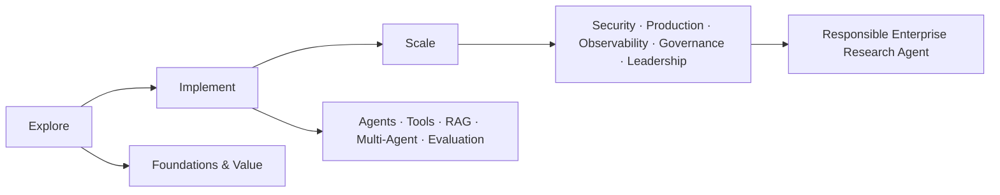
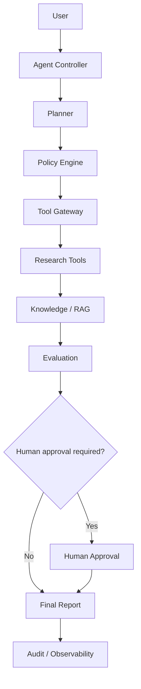

# Agentic AI Academy

## Engineering trustworthy AI agents from learning to production.

**EXPLORE • IMPLEMENT • SCALE**

**By Hendar Mawan, PhD**

> **Hendar Mawan : AI Engineering Leader**  
> AI Engineering · AI Architecture · Agentic AI · Secure AI · Edge AI · AI Governance

<p align="center">
  <a href="https://hendarmawan.se/agentic-ai/"><strong>Academy Website</strong></a> ·
  <a href="#getting-started-in-5-minutes"><strong>Start Learning</strong></a> ·
  <a href="projects/10-enterprise-agentic-ai-capstone/README.md"><strong>Capstone</strong></a> ·
  <a href="docs/13-enterprise-architecture.md"><strong>Architecture</strong></a> ·
  <a href="docs/security.md"><strong>Security</strong></a>
</p>

<p align="center">
  <a href="https://github.com/h00w/agentic-ai/actions/workflows/ci.yml"></a>
  <a href="https://www.python.org/"></a>
  <a href="LICENSE"></a>
  <a href="curriculum/"></a>
  <a href="evaluation/"></a>
  <a href="docs/security.md"></a>
  <a href="CHANGELOG.md"></a>
</p>

<p align="center">
  <a href="https://hendarmawan.se/agentic-ai/">
    
  </a>
</p>

**Agentic AI Academy** is an open-source curriculum, engineering laboratory, reference architecture, and professional portfolio for learning how to design, build, evaluate, secure, operate, govern, and scale AI agents.

This is not a collection of chatbot tutorials. The Academy treats agentic AI as a **systems-engineering discipline**: capability must be paired with measurable reliability, bounded autonomy, explicit permissions, evaluation, observability, governance, and safe failure behavior.

**Canonical source:** this repository  
**Professional Academy page:** https://hendarmawan.se/agentic-ai/  
**Interactive Hugging Face and Streamlit demos:** planned for the next deployment phase

---

## Why Agentic AI?

Generative models can produce useful outputs, but production agents must do more. They maintain state, choose tools, interact with external systems, recover from failure, operate under permissions, generate evidence, and stop safely.

The central engineering question is not simply:

> *Can the model act?*

It is:

> *Can the complete system act reliably, safely, observably, economically, and accountably?*

That distinction drives the architecture of this Academy.

## What You Will Learn

The curriculum progresses from fundamentals to professional deployment:



A learner completing the full pathway should be able to move through:

**AI foundations → agent fundamentals → Python implementation → single-agent systems → tools → memory → RAG → multi-agent systems → evaluation → security → production → observability → governance → enterprise architecture → AI leadership.**

## Who This Is For

The Academy supports multiple entry points: complete beginners, Python developers, AI/ML engineers, software engineers, researchers, students, technical professionals, AI product managers, enterprise architects, and technology leaders.

Choose the relevant path in [`learning-paths/`](learning-paths/).

## Learning Philosophy

The default learning mix is **30% theory · 50% implementation · 20% reflection and evaluation**.

Every module is designed to answer:

- Why does this matter?
- What should I learn?
- How do I implement it?
- What can go wrong?
- How do professionals solve it?
- How does this appear in interviews?
- How does this appear in production?
- What should I build next?

Concepts come before frameworks. Use a deterministic workflow when a task is stable and fully specifiable. Use an agent when uncertainty, planning, tool selection, adaptive sequencing, or iterative recovery create material value. Use multi-agent systems only when specialization or parallel decomposition produces measurable benefit.

## Curriculum

| # | Module | Core outcome |
|---|---|---|
| 01 | [Exploring Agentic AI](curriculum/01-exploring-agentic-ai/README.md) | Evaluate opportunity, autonomy, constraints, and organizational value. |
| 02 | [Python for Agentic AI](curriculum/02-python-for-agentic-ai/README.md) | Build the Python skills used directly in agent engineering. |
| 03 | [LLM & Agent Foundations](curriculum/03-llm-agent-foundations/README.md) | Understand structured outputs, planning, verification, and model choice. |
| 04 | [Single-Agent Engineering](curriculum/04-single-agent-engineering/README.md) | Implement bounded, stateful, tool-using agent loops. |
| 05 | [Tools, APIs & MCP](curriculum/05-tools-apis-mcp/README.md) | Design tool schemas, API integrations, permissions, and boundaries. |
| 06 | [RAG, Knowledge & Memory](curriculum/06-rag-memory-knowledge/README.md) | Build grounded retrieval and durable state. |
| 07 | [Multi-Agent Systems](curriculum/07-multi-agent-systems/README.md) | Design delegation, routing, supervision, and shared state. |
| 08 | [Agent Evaluation](curriculum/08-agent-evaluation/README.md) | Measure success, correctness, groundedness, safety, latency, and cost. |
| 09 | [Security & Safety](curriculum/09-agent-security/README.md) | Apply least privilege, sandboxing, policy enforcement, approval, and audit controls. |
| 10 | [Production Agent Engineering](curriculum/10-production-engineering/README.md) | Package, deploy, recover, rate-limit, route, and operate agents. |
| 11 | [Observability & Operations](curriculum/11-observability/README.md) | Trace trajectories, tool calls, token usage, cost, failures, and drift. |
| 12 | [Governance, Risk & Scaling](curriculum/12-governance-scaling/README.md) | Build risk registers, deployment gates, incident processes, and scaling playbooks. |
| 13 | [Enterprise Agentic AI Architecture](curriculum/13-enterprise-architecture/README.md) | Architect model/tool gateways, policy, identity, knowledge, evaluation, and audit. |
| 14 | [Agentic AI Leadership & Strategy](curriculum/14-agentic-ai-leadership/README.md) | Prioritize portfolios, quantify ROI/TCO, and lead responsible transformation. |

## Learning Pathways

- [Complete Beginner](learning-paths/beginner.md) — 12–16 weeks
- [Python Developer](learning-paths/python-developer.md) — 8–10 weeks
- [AI/ML Engineer](learning-paths/ai-engineer.md) — 8 weeks
- [AI Product Manager](learning-paths/product-manager.md) — 6 weeks
- [AI Architect / Technical Leader](learning-paths/architect.md) — 8 weeks
- [Researcher](learning-paths/researcher.md) — architecture, planning, memory, evaluation, multi-agent systems, trustworthy AI

## Engineering Proof

The Academy includes:

- **14 curriculum modules** with coaching, exercises, assessments, production framing, and portfolio evidence.
- **10 enterprise case studies** across research, support, software engineering, cybersecurity, finance, HR, sales, healthcare administration, manufacturing, and public-sector knowledge work.
- **10 progressive portfolio projects** from a Python tool chest to the enterprise capstone.
- **11 runnable examples** covering agent loops, function calling, tools, memory, RAG, guardrails, evaluation, multi-agent patterns, observability, and secure agents.
- **Reusable evaluation infrastructure** for task success, correctness, groundedness, tool accuracy, safety, latency, token usage, and estimated cost.
- **Security architecture** based on least privilege, explicit tool permissions, validation, policy gates, human approval, sandbox boundaries, timeouts, budgets, network restrictions, and audit logging.
- **Production engineering** with tests, Docker, CI, configuration, health checks, logging, reliability patterns, and operational controls.

## Flagship Capstone

### Responsible Enterprise Research Agent

The flagship capstone integrates planning, policy enforcement, bounded tool use, retrieval, memory, evaluation, human approval, cost controls, failure recovery, and auditability.



[View the capstone →](projects/10-enterprise-agentic-ai-capstone/README.md)

## Technology Stack

- **Core:** Python 3.12+, type hints, dataclasses, Pydantic, pytest, asyncio, pathlib, logging
- **Agent strategy:** framework-neutral first; optional LangGraph, CrewAI, and Microsoft agent ecosystem patterns
- **Knowledge:** in-memory learning references; optional Chroma and PostgreSQL + pgvector extensions
- **Evaluation:** pytest + custom deterministic evaluation harness
- **Operations:** Docker, GitHub Actions, OpenTelemetry-compatible tracing, Prometheus-style metrics
- **Security:** explicit permissions, policy gates, approval points, resource budgets, execution isolation, audit logging
- **Interfaces:** Hugging Face / Gradio and Streamlit deployment templates for the next phase

## Getting Started in 5 Minutes

### 1. Clone

```bash
git clone https://github.com/h00w/agentic-ai.git
cd agentic-ai
```

### 2. Create an isolated Python environment

**macOS / Linux**

```bash
python3.12 -m venv .venv
source .venv/bin/activate
```

**Windows PowerShell**

```powershell
py -3.12 -m venv .venv
.\.venv\Scripts\Activate.ps1
```

### 3. Install

```bash
python -m pip install --upgrade pip
pip install -e ".[dev]"
```

### 4. Verify the repository

```bash
pytest
python scripts/validate_examples.py
python scripts/check_links.py
```

### 5. Run your first agent example

```bash
python examples/01_hello_agent.py
python examples/02_agent_loop.py
python examples/04_tool_agent.py
```

**No API key is required** for the core curriculum, deterministic examples, tests, or evaluation exercises. External model providers are optional extensions.

### Recommended first learning route

If you are new to Agentic AI:

1. [Module 01 — Exploring Agentic AI](curriculum/01-exploring-agentic-ai/README.md)
2. [Module 02 — Python for Agentic AI](curriculum/02-python-for-agentic-ai/README.md)
3. Run [`examples/01_hello_agent.py`](examples/01_hello_agent.py)
4. Run [`examples/02_agent_loop.py`](examples/02_agent_loop.py)
5. Continue with the [Complete Beginner pathway](learning-paths/beginner.md)

## Production Readiness

Production-ready agents need explicit owners, measurable task success, bounded autonomy, deterministic safety controls, retries and timeouts, fallback behavior, cost and token budgets, observability, incident response, rollback, regression tests, and change-control evidence.

Use the [Production Readiness Checklist](docs/production-readiness-checklist.md).

## Security

Security is a throughline, not a single chapter. Privileged actions should pass through authentication/authorization, policy evaluation, input/output validation, bounded tool permissions, execution isolation, resource limits, approval rules, and audit logging.

Start with [docs/security.md](docs/security.md) and [SECURITY.md](SECURITY.md).

## Governance

The repository includes an [Agent Risk Register](docs/agent-risk-register.md), [Governance Checklist](docs/agent-governance-checklist.md), [Deployment Playbook](docs/deployment-playbook.md), and enterprise architecture guidance.

## Career Outcomes

Completion is designed to produce portfolio evidence for roles such as:

**Agentic AI Engineer · AI Engineer · Production AI Engineer · AI Architect · Applied AI Lead · AI Platform Engineer · Trustworthy AI Engineer · AI Security Engineer · AI Product Manager · AI Engineering Leader**

## Repository Structure

```text
agentic-ai/
├── curriculum/        # 14 modules
├── learning-paths/    # role-based self-study sequences
├── case-studies/      # 10 enterprise scenarios
├── projects/          # 10 progressive portfolio builds
├── labs/              # guided implementation exercises
├── examples/          # safe runnable examples
├── evaluation/        # datasets, evaluators, metrics, safety/regression tests
├── src/agentic_ai/    # framework-neutral reference implementation
├── tests/             # unit/integration tests
├── docs/              # handbook, governance and architecture guidance
├── demo/              # Hugging Face + Streamlit deployment templates
├── website/           # static academy assets
└── .github/workflows/ # CI
```

## Release & Roadmap

- Current public milestone: **v0.1.0 — Initial Academy Release**
- Release notes: [`RELEASE_NOTES_v0.1.0.md`](RELEASE_NOTES_v0.1.0.md)
- Changelog: [`CHANGELOG.md`](CHANGELOG.md)
- Roadmap: [`ROADMAP.md`](ROADMAP.md)
- Citation metadata: [`CITATION.cff`](CITATION.cff)

The next deployment phase focuses on the public Hugging Face playground, evaluation dataset, and advanced Streamlit engineering lab.

## Contribution

Contributions are welcome when they preserve the Academy's principles: concept-first teaching, safe runnable examples, production credibility, explicit security boundaries, reproducible evaluation, and vendor neutrality.

See [CONTRIBUTING.md](CONTRIBUTING.md).

## Author

**Hendar Mawan, PhD**  
**Hendar Mawan : AI Engineering Leader**  
AI Engineering · AI Architecture · Agentic AI · Secure AI · Edge AI · AI Governance

- Academy: https://hendarmawan.se/agentic-ai/
- Website: https://hendarmawan.se
- GitHub: https://github.com/h00w
- LinkedIn: https://www.linkedin.com/in/hender
- Email: hendar@hendarmawan.se

---

**Agentic AI Academy — Engineering trustworthy AI agents from learning to production.**
