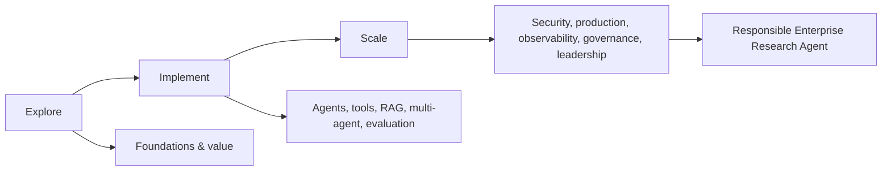
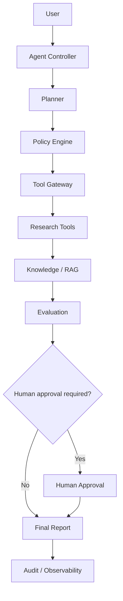

# Agentic AI Academy

## Engineering trustworthy AI agents from learning to production.

**EXPLORE • IMPLEMENT • SCALE**

**By Hendar Mawan, PhD**

> **Hendar Mawan : AI Engineering Leader**  
> AI Engineering · AI Architecture · Agentic AI · Secure AI · Edge AI · AI Governance


<h1 align="center">Agentic AI</h1>

<p align="center">
  <strong>From Foundations to Production-Grade Autonomous AI Systems</strong>
</p>

<p align="center">
  <a href="https://www.python.org/">
    
  </a>
  <a href="LICENSE">
    
  </a>
  <a href="curriculum/">
    
  </a>
  <a href="docs/security.md">
    
  </a>
  <a href="evaluation/">
    
  </a>
</p>

<p align="center">
  <a href="https://hendarmawan.se">
    
  </a>
</p>

Agentic AI Academy is an open-source curriculum, engineering laboratory, reference architecture, and professional portfolio for learning how to design, build, evaluate, secure, operate, govern, and scale AI agents. It is deliberately framework-neutral: learners master the engineering concepts first, then apply those concepts using selected frameworks where they add value.

## Why Agentic AI?

Generative models can produce useful outputs, but production agents must do more: maintain state, choose tools, interact with external systems, recover from failure, operate under explicit permissions, generate evidence, and stop safely. Those capabilities create business value only when autonomy is bounded by measurable reliability, security, governance, and operational controls.

This academy treats agentic AI as a systems-engineering discipline rather than a prompting trick. The central question is not *“Can the model act?”* but *“Can the complete system act reliably, safely, observably, and accountably?”*

## What You Will Learn

By the end, you should be able to move from AI fundamentals to agent fundamentals, Python implementation, single-agent systems, tool use, memory, RAG, multi-agent orchestration, evaluation, security, production engineering, observability, governance, enterprise architecture, and strategic scaling.



## Who This Is For

Complete beginners, Python developers, AI/ML engineers, software engineers, researchers, students, technical professionals, AI product managers, enterprise architects, and technology leaders. Use the [learning pathways](learning-paths/) to enter at the right level.

## Learning Philosophy

The default mix is **30% theory, 50% implementation, 20% reflection and evaluation**. Every module includes learning objectives, architecture, runnable examples, exercises, challenge work, case-study context, assessment prompts, professional coaching, interview framing, production framing, and portfolio evidence.

Concepts come before frameworks. Use a deterministic workflow when the task is stable, bounded, and fully specifiable. Use an agent when the environment is uncertain enough that planning, tool selection, adaptive sequencing, or iterative recovery provides material value. Use multi-agent systems only when role specialization or parallel decomposition measurably improves the outcome.

## Curriculum

| # | Module | Core outcome |
|---|---|---|
| 01 | [Exploring Agentic AI](curriculum/01-exploring-agentic-ai/README.md) | Evaluate opportunity, autonomy, constraints, and organizational value. |
| 02 | [Python for Agentic AI](curriculum/02-python-for-agentic-ai/README.md) | Build the Python skills used directly in agent engineering. |
| 03 | [LLM & Agent Foundations](curriculum/03-llm-agent-foundations/README.md) | Understand model behavior, structured outputs, planning, verification, and model choice. |
| 04 | [Single-Agent Engineering](curriculum/04-single-agent-engineering/README.md) | Implement a bounded, stateful, tool-using agent loop. |
| 05 | [Tools, APIs & MCP](curriculum/05-tools-apis-mcp/README.md) | Design tool schemas, permissions, API integrations, and MCP boundaries. |
| 06 | [RAG, Knowledge & Memory](curriculum/06-rag-memory-knowledge/README.md) | Build grounded retrieval and durable state. |
| 07 | [Multi-Agent Systems](curriculum/07-multi-agent-systems/README.md) | Design delegation, routing, supervision, and shared state. |
| 08 | [Agent Evaluation](curriculum/08-agent-evaluation/README.md) | Measure task success, correctness, groundedness, safety, latency, and cost. |
| 09 | [Security & Safety](curriculum/09-agent-security/README.md) | Apply least privilege, sandboxing, policy enforcement, approval, and audit controls. |
| 10 | [Production Agent Engineering](curriculum/10-production-engineering/README.md) | Package, deploy, recover, rate-limit, route, and operate agents. |
| 11 | [Observability & Operations](curriculum/11-observability/README.md) | Trace trajectories, tool calls, tokens, latency, cost, failures, and drift. |
| 12 | [Governance, Risk & Scaling](curriculum/12-governance-scaling/README.md) | Build risk registers, deployment gates, incident processes, and scaling playbooks. |
| 13 | [Enterprise Agentic AI Architecture](curriculum/13-enterprise-architecture/README.md) | Architect model gateways, tool gateways, policy, identity, knowledge, evaluation, and audit. |
| 14 | [Agentic AI Leadership & Strategy](curriculum/14-agentic-ai-leadership/README.md) | Prioritize portfolios, quantify ROI/TCO, and lead responsible enterprise transformation. |

## Learning Pathways

Choose a pathway based on your role: [Complete Beginner](learning-paths/beginner.md), [Python Developer](learning-paths/python-developer.md), [AI/ML Engineer](learning-paths/ai-engineer.md), [AI Product Manager](learning-paths/product-manager.md), [AI Architect / Technical Leader](learning-paths/architect.md), or [Researcher](learning-paths/researcher.md).

## Technology Stack

- **Core:** Python 3.12+, type hints, dataclasses, Pydantic, pytest, asyncio, pathlib, logging.
- **Agent patterns:** framework-neutral first; optional LangGraph, CrewAI, and Microsoft Agent Framework / AutoGen ecosystem examples.
- **Knowledge:** in-memory references for learning; optional Chroma, PostgreSQL + pgvector for production extensions.
- **Interfaces:** Gradio / Hugging Face Spaces, Streamlit, static GitHub Pages academy.
- **Operations:** Docker, GitHub Actions, OpenTelemetry-compatible tracing, Prometheus-style metrics.
- **Security:** explicit tool permissions, policy gates, approval points, resource budgets, sandbox boundaries, audit logging.

## Hands-on Projects

The [projects](projects/) directory contains ten progressive portfolio projects from a Python tool chest to the Responsible Enterprise Research Agent capstone. Each project includes architecture, objectives, requirements, installation, source code, tests, expected output, failure modes, security considerations, and extension exercises.

## Case Studies

Ten realistic [case studies](case-studies/) connect technical design to customer support, enterprise research, software engineering, cybersecurity, financial analysis, HR, sales, healthcare administration, manufacturing operations, and public-sector knowledge work.

## Labs

The [labs](labs/) directory contains guided exercises for agent loops, tools, RAG, memory, evaluation, security, production reliability, observability, and governance. Labs use deterministic mock tools wherever an external API is unnecessary.

## Assessments

The academy uses six progressive levels: **Foundation → Builder → Engineer → Production Engineer → Architect → AI Leader**. See the [assessment framework](docs/assessment-framework.md) for rubrics across knowledge, coding, architecture, security, evaluation, communication, business value, and production readiness.

## Capstone

The flagship [Responsible Enterprise Research Agent](projects/10-enterprise-agentic-ai-capstone/README.md) integrates planning, policy, tool use, RAG, memory, evaluation, human approval, cost controls, failure recovery, and audit/observability.



## Production Readiness

Production-ready agents must have explicit owners, measurable task success, bounded autonomy, deterministic safety controls, retries and timeouts, fallback behavior, cost and token budgets, observability, incident response, rollback, regression tests, and change-control evidence. See [Production Readiness Checklist](docs/production-readiness-checklist.md).

## Security

Security is a throughline, not a single chapter. Every privileged action should pass through authentication/authorization, policy evaluation, input/output validation, bounded tool permissions, execution isolation, resource limits, approval rules, and audit logging. Start with [docs/security.md](docs/security.md) and [SECURITY.md](SECURITY.md).

## Governance

Governance turns technical controls into accountable operating practice. The repository includes an [Agent Risk Register](docs/agent-risk-register.md), [Governance Checklist](docs/agent-governance-checklist.md), [Deployment Playbook](docs/deployment-playbook.md), and enterprise architecture guidance.

## Career Outcomes

Completion should produce portfolio evidence for roles such as Agentic AI Engineer, AI Engineer, Production AI Engineer, AI Architect, Applied AI Lead, AI Platform Engineer, Trustworthy AI Engineer, AI Security Engineer, AI Product Manager, and AI Transformation / Technology Leader.

## Repository Structure

```text
agentic-ai/
├── curriculum/        # 14 modules
├── learning-paths/    # role-based self-study sequences
├── case-studies/      # 10 enterprise scenarios
├── projects/          # 10 progressive portfolio builds
├── labs/              # guided implementation exercises
├── examples/          # runnable safe examples
├── evaluation/        # datasets, evaluators, metrics, safety/regression tests
├── src/agentic_ai/    # reusable framework-neutral reference implementation
├── tests/             # unit/integration tests
├── docs/              # academy handbook and architecture guidance
├── demo/              # Hugging Face + Streamlit public demos
├── website/           # static academy site for GitHub Pages
└── .github/workflows/ # CI
```

## Getting Started

```bash
git clone https://github.com/h00w/agentic-ai.git
cd agentic-ai
python -m venv .venv
# macOS/Linux
source .venv/bin/activate
# Windows PowerShell
# .venv\Scripts\Activate.ps1
pip install -e .[dev]
pytest
python examples/01_hello_agent.py
```

No API key is required for the core curriculum, examples, tests, or demos. External-model integrations are optional extensions.

## Public Demo Ecosystem

| Resource | Purpose |
|---|---|
| GitHub `h00w/agentic-ai` | Canonical curriculum and source |
| Hugging Face Space `h0000w/hendar-agentic-ai` | Interactive public demo |
| Hugging Face Dataset `h0000w/hendar-agentic-ai-dataset` | Evaluation/training/demo data |
| Hugging Face Model `h0000w/hendar-agentic-ai` | Model/agent artifacts |
| GitHub Pages | Professional Academy website |
| Streamlit | Advanced experimental labs |

See [docs/demo-deployment.md](docs/demo-deployment.md) for the deployment workflow.

## Contribution

Contributions are welcome when they preserve the academy's principles: concept-first teaching, safe runnable examples, production credibility, explicit security boundaries, reproducible evaluation, and vendor neutrality. See [CONTRIBUTING.md](CONTRIBUTING.md).

## Author

**Hendar Mawan, PhD**  
**Hendar Mawan : AI Engineering Leader**  
AI Engineering · AI Architecture · Agentic AI · Secure AI · Edge AI · AI Governance

- Website: https://hendarmawan.se
- GitHub: https://github.com/h00w
- LinkedIn: https://www.linkedin.com/in/hender
- Email: hendar@hendarmawan.se

---

**Agentic AI Academy — Engineering trustworthy AI agents from learning to production.**
