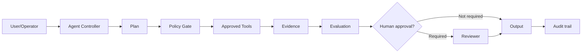

# Enterprise Research Agent

## Business problem
Analysts spend hours collecting, reconciling and citing evidence across approved sources.

## Current workflow
A human collects inputs, searches multiple systems, interprets policy or evidence, drafts a response/action, requests review when needed, and records the outcome. The workflow contains manual delay, inconsistent evidence capture, and repeated low-value coordination.

## Proposed agentic workflow

## Stakeholders
Business owner, domain expert, product manager, AI/ML engineer, platform engineer, security, privacy/legal/compliance, operations/SRE, end users, and an accountable approver for high-impact actions.

## Tools
Use explicit allowlisted tools only. Prefer read-only search/retrieval first; isolate any state-changing API behind authentication, authorization, policy, validation, approval, quotas, and audit logging.

## Data
Classify source data by sensitivity, residency, retention, access rights, provenance, freshness, and quality. Retrieval evidence must preserve source identity and authorization context.

## Autonomy level
Start at **assistive / recommend-only**, move to **execute-with-approval**, and grant limited autonomous low-risk actions only after evaluation evidence supports the transition.

## Risks
Prompt injection, wrong or stale evidence, hallucinated facts, excessive agency, privilege misuse, privacy leakage, unbounded retries, cost spikes, hidden failure, and operator over-trust.

## Safeguards
Least privilege, structured input/output, source allowlists, retrieval citations, policy gates, human approval, timeouts, budgets, rate limits, trace logging, regression tests, incident runbooks, rollback, and periodic access reviews.

## KPIs
Task success, first-pass resolution, human correction rate, groundedness, tool accuracy, escalation rate, safety violations, p95 latency, cost per successful task, user satisfaction, and time saved.

## ROI considerations
Model total benefit from labor time avoided, response quality, throughput, risk reduction and customer/employee experience. Include platform, model, observability, evaluation, security, support, governance, integration, and change-management costs.

## Architecture
Separate model reasoning from deterministic identity, policy, tools, data access, execution isolation, evaluation, approvals and audit infrastructure.

## Implementation plan
1. Baseline the current workflow and error rate.
2. Define the smallest high-value bounded task.
3. Build a deterministic reference path and evaluation set.
4. Add model reasoning only where uncertainty justifies it.
5. Pilot with read-only tools and human review.
6. Measure, red-team and remediate.
7. Expand autonomy in gated stages.

## Scaling strategy
Standardize shared platform controls, tool contracts, evaluation, telemetry, model routing, policy, incident response and governance while keeping domain-specific prompts, retrieval, datasets and approval rules close to the business owner.

## Failure scenarios
- The agent retrieves stale or unauthorized data.
- A tool returns malicious instructions.
- The model chooses an incorrect privileged action.
- A downstream API times out after a partial change.
- Cost/latency exceeds the run budget.
- The agent is correct but cannot provide evidence.

Each scenario must have a detection signal, containment rule, user-facing behavior, recovery path, and audit record.
