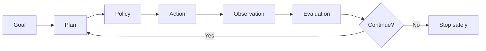

# Module 04: Single-Agent Engineering

**Learning objective:** Implement a bounded stateful agent loop before introducing orchestration frameworks.

## Why this matters

Agentic AI creates value by turning goals into bounded action across models, tools, data, people, and infrastructure. This module connects the concept to decisions that can be measured, reviewed, tested, and operated professionally.

## Learning objectives

By the end of this module you should be able to:

- Agent loop
- ReAct pattern conceptually
- Planning, action and observation
- Tool selection and execution
- Stopping conditions

## Concept map

## Lessons

1. **Agent loop.** Connect the concept to a runnable or reviewable artifact.
2. **ReAct pattern conceptually.** Connect the concept to a runnable or reviewable artifact.
3. **Planning, action and observation.** Connect the concept to a runnable or reviewable artifact.
4. **Tool selection and execution.** Connect the concept to a runnable or reviewable artifact.
5. **Stopping conditions.** Connect the concept to a runnable or reviewable artifact.
6. **Retries and error handling.** Connect the concept to a runnable or reviewable artifact.
7. **State.** Connect the concept to a runnable or reviewable artifact.
8. **Short-term and long-term memory.** Connect the concept to a runnable or reviewable artifact.
9. **Framework-neutral implementation then framework mappings.** Connect the concept to a runnable or reviewable artifact.

## Architecture

Professional implementations separate probabilistic reasoning from deterministic control. Identity, permissions, policy, validation, budgets, state, tool execution, evaluation, observability, and approval should remain explicit system concerns rather than being hidden inside a prompt.

## Example

Run the relevant example under `examples/` and inspect the matching reusable component under `src/agentic_ai/`. Replace the deterministic teaching function with an external model only after you can explain the control flow without it.

## Exercise

Model the problem as **goal → inputs → state → decision points → allowed actions → evidence → stopping condition**. Identify at least one step that should remain deterministic.

## Challenge

Add one failure condition, one recovery rule, one security control, one evaluation metric, and one observability event. Prove the system fails closed rather than silently continuing.

## Case study

**Smart Research Sidekick**

Analyze the current workflow, proposed agent workflow, stakeholders, tool permissions, data classes, autonomy level, safeguards, KPIs, ROI assumptions, scaling dependencies, and failure scenarios.

## Deliverable

**Smart Research Sidekick**

Store your deliverable in a portfolio repository with an architecture diagram, assumptions, test evidence, and a short risk section.

## Assessment

1. Explain the core architecture without using framework names.
2. Identify one reason to prefer a deterministic workflow over an autonomous agent.
3. Define a measurable success criterion and a failure criterion.
4. Identify a security boundary and an operational signal.

## Coach's Perspective

- **WHY does this matter?** Production agents change systems, not only text. The cost of ambiguity increases with autonomy.
- **WHAT should I learn?** The smallest set of concepts that lets you reason about control, evidence, permissions, and failure.
- **HOW do I implement it?** Start deterministic, isolate model-dependent decisions, validate structured data, and make boundaries explicit.
- **WHAT can go wrong?** Unbounded retries, hidden state, over-permissioned tools, weak grounding, silent degradation, and metrics that reward appearance rather than task success.
- **HOW do professionals solve it?** Layered controls, testable interfaces, policy gates, golden datasets, traces, runbooks, reviews, and controlled rollout.
- **HOW would this appear in an interview?** Expect architecture trade-offs, failure analysis, evaluation design, security controls, and a build-vs-workflow justification.
- **HOW would this appear in production?** As APIs, queues, policy decisions, tool gateways, state stores, traces, alerts, approvals, rollbacks, and audit records.
- **WHAT should I build next?** Extend the module deliverable into the next project while preserving tests and operational evidence.

### Career Skill

Translate an agentic AI concept into an inspectable engineering design.

### Portfolio Evidence

Publish an architecture diagram, runnable test, one evaluation result, one failure scenario, and one security decision.

### Interview Questions

- Where is autonomy useful and where is determinism safer?
- How would you evaluate this system before production?
- Which action requires human approval and why?

### Reflection Questions

- Which assumption in your design is least tested?
- What happens when the model is unavailable, wrong, slow, or over budget?
- Can an auditor reconstruct what happened after an incident?

### Challenge Exercise

Implement one additional guardrail or evaluation check and demonstrate both a passing and failing test.

## Further learning

Continue to the next module, then revisit this design after Modules 8–13. Production-quality Agentic AI is iterative: architecture improves as evaluation, security, operations, governance, and scaling constraints become concrete.
