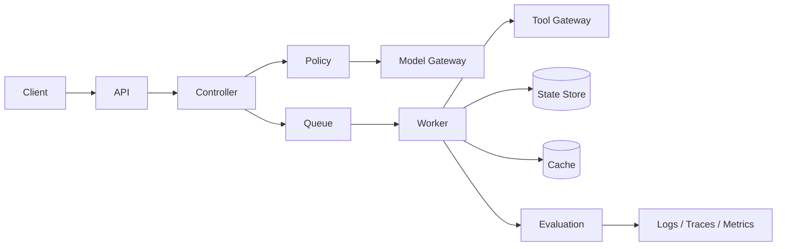

# Module 10: Production Agent Engineering

**Learning objective:** Engineer agent services that remain dependable under real traffic, partial failure, cost constraints, and operational change.

## Learning objectives
- production architecture, APIs, services and queues
- state stores and caching
- retries, timeouts, circuit breakers and fallbacks
- model routing, rate limiting, concurrency and cost control
- Docker, CI/CD, configuration and secrets management

## Architecture

## Lessons
1. API and service boundaries.
2. Queues and asynchronous work.
3. Durable state and idempotency.
4. Caching and model routing.
5. Retries, backoff, timeouts and circuit breakers.
6. Rate limits, concurrency and resource budgets.
7. Containerization and health checks.
8. CI/CD and progressive delivery.
9. Configuration and secrets management.
10. Recovery, fallback and rollback.

## Project
**Production Research Agent** — package the framework-neutral controller as a deployable service with health checks, configuration, logging, tests, CI and explicit failure behavior.

## Exercise
Choose one agent workflow and define its SLO, timeout budget, retry budget, idempotency rule, fallback, rollback trigger and cost ceiling.

## Challenge
Simulate a downstream timeout after a tool has partially completed work. Demonstrate how the system detects the ambiguous state without blindly repeating a state-changing action.

## Assessment
Explain where state lives, how duplicate delivery is handled, how model/tool outages degrade, how cost is bounded, and what evidence is required before promotion.

## Coach's Perspective
- **WHY does this matter?** A useful demo can still fail catastrophically under concurrency, partial failure or operational drift.
- **WHAT should I learn?** Reliability patterns and explicit service boundaries.
- **HOW do I implement it?** Make every external call bounded, observable and recoverable; make state-changing operations idempotent where possible.
- **WHAT can go wrong?** Retry storms, duplicate actions, stale state, hidden queue backlogs, cost spikes and unsafe fallbacks.
- **HOW do professionals solve it?** SLOs, runbooks, circuit breakers, backpressure, deployment gates and progressive rollout.
- **HOW would this appear in an interview?** Expect trade-offs around queues, idempotency, consistency, retries and failure recovery.
- **HOW would this appear in production?** As services, workers, model/tool gateways, state stores, telemetry and deployment controls.
- **WHAT should I build next?** Instrument the production service in Module 11.

### Career Skill
Production AI systems engineering.
### Portfolio Evidence
Docker/CI configuration, architecture diagram, tests and a documented failure-recovery run.
### Interview Questions
- When should a retry be prohibited?
- How would you prevent duplicate state-changing actions?
- What should an agent health check actually prove?
### Reflection Questions
- Which dependency dominates your error budget?
- What is your cheapest safe degraded mode?
### Challenge Exercise
Add a circuit breaker and test open, half-open and recovered behavior.

## Further learning
Continue to observability and operations; reliability without evidence is only an assumption.
