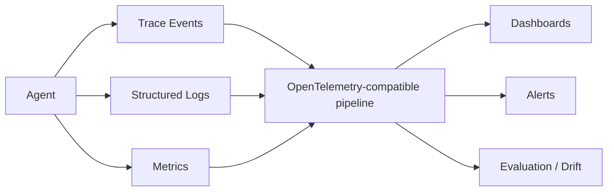

# Module 11: Observability and Operations

**Learning objective:** Make agent behavior inspectable through traces, logs, metrics, evaluation signals and operational alerts.

## Learning objectives
- tracing and structured logs
- agent trajectories and tool-call traces
- latency, token consumption and cost
- failure and task-success rates
- evaluation drift
- monitoring, alerting and incident evidence
- vendor-neutral OpenTelemetry concepts plus Phoenix, LangSmith, Prometheus and Grafana examples

## Architecture

## Lessons
1. What to observe in an agent run.
2. Correlation IDs and trace context.
3. Tool-call and policy-decision events.
4. Latency distributions and tail behavior.
5. Token and cost attribution.
6. Task success versus infrastructure success.
7. Evaluation drift and change detection.
8. Monitoring and alert design.
9. Incident reconstruction and retention.
10. Vendor-neutral instrumentation strategy.

## Project
**Agent Observability Dashboard** — expose run-level task success, safety, tool calls, p95 latency, token usage, estimated cost and failure categories.

## Assessment
Given a failed run, identify the minimum telemetry needed to reconstruct the trajectory and distinguish model, tool, policy, data and infrastructure failures.

## Coach's Perspective
- **WHY does this matter?** If operators cannot reconstruct an agent action, they cannot reliably improve, govern or defend it.
- **WHAT should I learn?** The semantic events that explain agent behavior, not just CPU and HTTP metrics.
- **HOW do I implement it?** Emit structured events at decision and boundary points with stable run IDs.
- **WHAT can go wrong?** Logging secrets, noisy traces, missing causality and dashboards without action thresholds.
- **HOW do professionals solve it?** Data minimization, sampling, retention policy, SLO-linked alerts and evaluation telemetry.
- **HOW would this appear in an interview?** Design an observability model for a tool-using agent.
- **HOW would this appear in production?** OpenTelemetry pipelines, dashboards, alerts and incident timelines.
- **WHAT should I build next?** Convert operational evidence into governance gates.

### Career Skill
Production AI observability and operations.
### Portfolio Evidence
Trace schema, dashboard screenshot/data and incident reconstruction example.
### Interview Questions
- What is the difference between an infrastructure success and an agent task success?
- How do you observe a multi-step trajectory?
### Reflection Questions
- Which event would you need first during an incident?
- Are you logging sensitive prompts or tool outputs unnecessarily?
### Challenge Exercise
Define an alert that combines task-success degradation and safety-event rate without alerting on harmless variance.

## Further learning
Continue to governance, risk and scaling.
