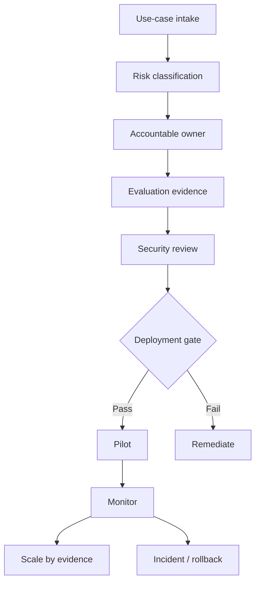

# Module 12: Governance, Risk and Scaling

**Learning objective:** Construct a strategic agentic AI deployment playbook that integrates risk, governance and phased scaling considerations.

## Learning objectives
- AI and agent governance
- risk classification and accountable ownership
- human oversight and auditability
- privacy and compliance
- deployment gates
- incident management and rollback
- change management, adoption and operating models

## Architecture

## Required artifacts
- [Agent Risk Register](../../docs/agent-risk-register.md)
- [Agent Governance Checklist](../../docs/agent-governance-checklist.md)
- [Production Readiness Checklist](../../docs/production-readiness-checklist.md)
- [Deployment Playbook](../../docs/deployment-playbook.md)

## Lessons
1. Classify impact and autonomy.
2. Assign business, technical and risk ownership.
3. Define human oversight by consequence, not convenience.
4. Preserve evidence and auditability.
5. Establish privacy and compliance controls.
6. Gate releases on evaluation/security evidence.
7. Prepare incident, rollback and notification processes.
8. Manage prompt/model/tool/data changes as production changes.
9. Build adoption and workforce readiness.
10. Scale through a repeatable operating model.

## Assessment
Build a phased deployment decision for a medium-risk enterprise agent and justify which evidence moves it from suggest-only to approval-required to bounded low-risk autonomy.

## Coach's Perspective
- **WHY does this matter?** Scaling multiplies both value and failure impact.
- **WHAT should I learn?** How technical evidence becomes an organizational control.
- **HOW do I implement it?** Explicit owners, risk tiers, gates, monitoring and rollback criteria.
- **WHAT can go wrong?** Governance theatre, unclear accountability, permanent pilots and unreviewed capability expansion.
- **HOW do professionals solve it?** Evidence-based gates and lifecycle ownership.
- **HOW would this appear in an interview?** Explain how you would approve, monitor and revoke an agent capability.
- **HOW would this appear in production?** Registries, risk records, approvals, deployment gates and incident processes.
- **WHAT should I build next?** Consolidate these controls into an enterprise reference architecture.

### Career Skill
AI governance and responsible scaling.
### Portfolio Evidence
Risk register, governance checklist and deployment playbook.
### Interview Questions
- Who owns an agent incident?
- What evidence should block deployment?
### Reflection Questions
- Can autonomy be reduced quickly after an incident?
- Which change types require re-evaluation?
### Challenge Exercise
Design a four-gate lifecycle from sandbox to enterprise-wide deployment.

## Further learning
Continue to Module 13.
