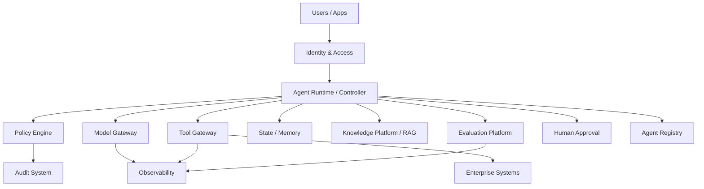

# Module 13: Enterprise Agentic AI Architecture

**Learning objective:** Design an enterprise agent platform with explicit identity, policy, tool, model, knowledge, evaluation, observability and human-control boundaries.

## Reference architecture

## Lessons
1. Enterprise agent platform boundaries.
2. Identity and delegated authority.
3. Policy engines and decision points.
4. Tool gateways and credential isolation.
5. Agent registries and lifecycle metadata.
6. Model gateways and routing.
7. Knowledge platforms and authorization-aware retrieval.
8. Evaluation infrastructure.
9. Observability and audit infrastructure.
10. Human approval and exception handling.
11. Security zones, data boundaries and network policy.
12. Platform-versus-domain ownership.

## Deliverable
**Enterprise Agentic AI Reference Architecture** with trust boundaries, data flows, identities, policy decisions, approval points, telemetry, ownership and failure domains.

## Coach's Perspective
- **WHY does this matter?** Enterprise scale requires reusable control planes rather than one-off agents.
- **WHAT should I learn?** Which concerns must be centralized and which must remain domain-specific.
- **HOW do I implement it?** Standardize gateways, identity, policy, telemetry and evaluation while allowing bounded domain workflows.
- **WHAT can go wrong?** A monolithic platform, shared over-privileged credentials, cross-domain data leakage and platform controls nobody owns.
- **HOW do professionals solve it?** Clear trust boundaries, tenancy, policy enforcement points and platform SLOs.
- **HOW would this appear in an interview?** Whiteboard a secure enterprise agent platform and explain the failure domains.
- **HOW would this appear in production?** Shared gateways, registries, policy/evaluation services and domain agent products.
- **WHAT should I build next?** Translate architecture into an executive portfolio and operating model.

### Career Skill
Enterprise AI architecture.
### Portfolio Evidence
Reference architecture and architecture decision records.
### Interview Questions
- Where should credentials terminate?
- Which services form the control plane?
- How do you prevent one agent from crossing another domain's permissions?
### Reflection Questions
- What becomes a platform responsibility at 100 agents?
- Which control should remain closest to the business owner?
### Challenge Exercise
Design tenant isolation for three business domains sharing one model gateway.

## Further learning
Continue to leadership and strategy.
