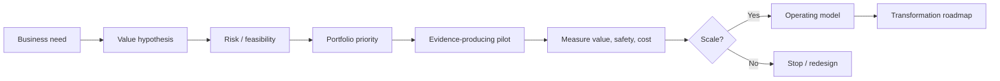

# Module 14: Agentic AI Leadership and Strategy

**Learning objective:** Prioritize and lead an Agentic AI portfolio that creates measurable value while respecting organizational readiness and risk appetite.

## Learning objectives
- identify high-value opportunities
- build vs buy
- ROI and total cost of ownership
- organizational readiness and workforce impact
- AI operating model and governance
- portfolio prioritization and risk appetite
- executive communication
- transformation roadmap

## Strategy loop

## Lessons
1. Opportunity discovery from workflows, not hype.
2. Build-versus-buy criteria.
3. ROI, TCO and uncertainty ranges.
4. Readiness across data, process, people and platform.
5. Workforce augmentation and role redesign.
6. Governance and risk appetite.
7. Portfolio prioritization.
8. Operating models and centers of enablement.
9. Executive metrics and communication.
10. Phased transformation roadmap.

## Final deliverable
**Agentic AI Strategy for an Enterprise** — include opportunity portfolio, value model, risk tiers, target architecture, operating model, capability roadmap, workforce plan, governance, KPI tree and phased investment decision.

## Coach's Perspective
- **WHY does this matter?** Most enterprise AI value is lost through poor prioritization, weak adoption or unmanaged lifecycle cost rather than model capability.
- **WHAT should I learn?** How to connect technical architecture to business value, operating constraints and decision rights.
- **HOW do I implement it?** Fund evidence, not demos; use stage gates and measurable value hypotheses.
- **WHAT can go wrong?** Automation-first thinking, hidden TCO, portfolio sprawl, weak ownership and autonomy beyond risk appetite.
- **HOW do professionals solve it?** Portfolio governance, reusable platforms, product ownership and outcome-based measurement.
- **HOW would this appear in an interview?** Present a 12–24 month roadmap and defend investment sequencing.
- **HOW would this appear in production?** A governed portfolio of agent products using shared controls and measurable outcomes.
- **WHAT should I build next?** Complete the capstone and publish the architecture, evaluation and business case together.

### Career Skill
AI leadership, portfolio strategy and transformation architecture.
### Portfolio Evidence
Executive strategy deck/brief with ROI model and phased roadmap.
### Interview Questions
- Which use cases would you reject and why?
- How do you quantify TCO for an agent platform?
- What evidence justifies increasing autonomy?
### Reflection Questions
- Is the organization ready to own the agent after launch?
- Which benefit can be measured within one quarter?
### Challenge Exercise
Rank five candidate agents using value, feasibility, risk, adoption effort and platform reuse.

## Further learning
Complete the Responsible Enterprise Research Agent capstone and revisit every earlier module through the lens of lifecycle evidence.
