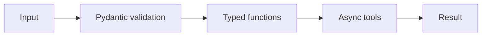

# Python for Agents

Focus on the language features that directly support agent engineering: typed functions, dataclasses, Pydantic models, exceptions, async I/O, context managers, modules, JSON/HTTP boundaries and environment configuration.

## Architecture

## Professional practice

Define ownership, interfaces, failure behavior, security boundaries, evidence, SLOs, cost limits, release criteria and rollback before increasing autonomy. Prefer small composable controls over one opaque “agent framework” abstraction.

## Review questions

- What is deterministic and what is probabilistic?
- Which action has the highest blast radius?
- What evidence proves the design works?
- Which telemetry detects silent failure?
- What is the safe fallback?
