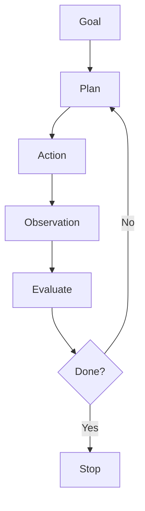

# Agent Fundamentals

An agent is a controlled system that transforms a goal into decisions and actions under state, permissions, evidence, budgets and stopping rules. The model is one component, not the system boundary.

## Architecture

## Professional practice

Define ownership, interfaces, failure behavior, security boundaries, evidence, SLOs, cost limits, release criteria and rollback before increasing autonomy. Prefer small composable controls over one opaque “agent framework” abstraction.

## Review questions

- What is deterministic and what is probabilistic?
- Which action has the highest blast radius?
- What evidence proves the design works?
- Which telemetry detects silent failure?
- What is the safe fallback?
