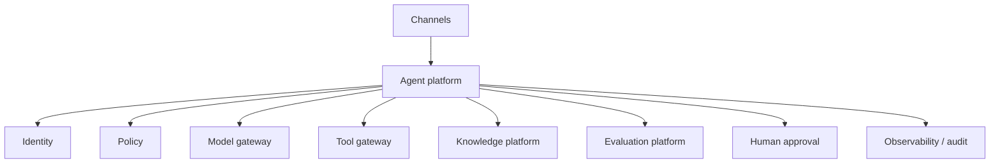

# Enterprise Agentic AI Architecture

Centralize shared controls without forcing every business workflow into one agent framework. The platform should provide identity, policy, model routing, tool gateways, knowledge access, evaluation, telemetry, approvals and audit.

## Architecture

## Professional practice

Define ownership, interfaces, failure behavior, security boundaries, evidence, SLOs, cost limits, release criteria and rollback before increasing autonomy. Prefer small composable controls over one opaque “agent framework” abstraction.

## Review questions

- What is deterministic and what is probabilistic?
- Which action has the highest blast radius?
- What evidence proves the design works?
- Which telemetry detects silent failure?
- What is the safe fallback?
