# Architecture Diagram Index

## 1. Agent loop
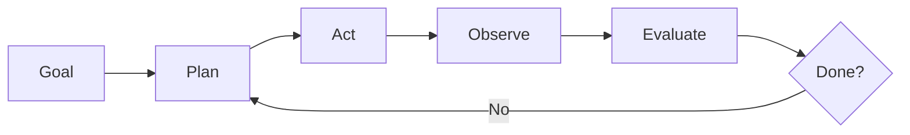

## 2. Tool calling
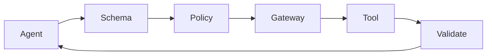

## 3. RAG
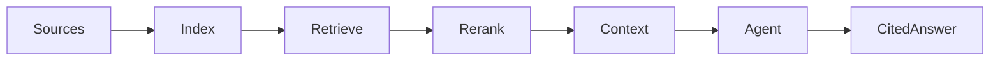

## 4. Memory
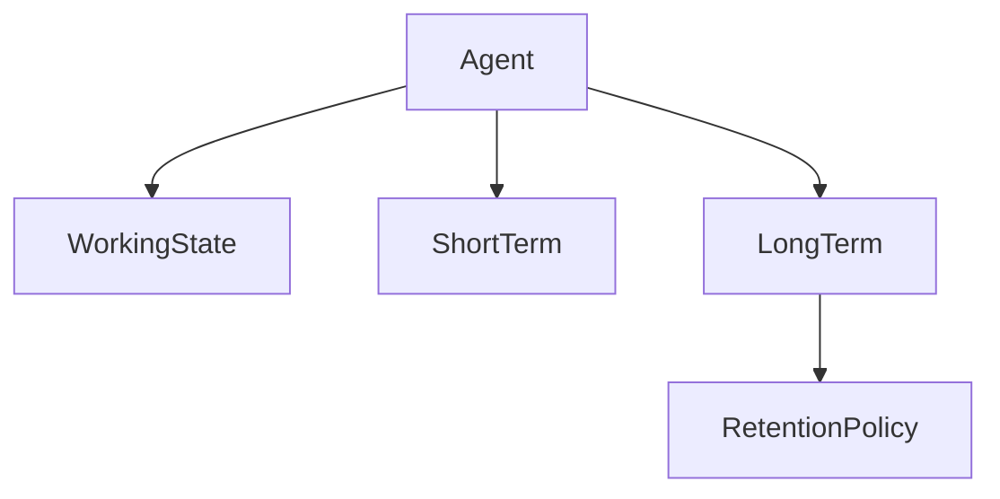

## 5. Multi-agent
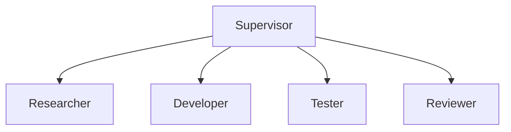

## 6. Evaluation
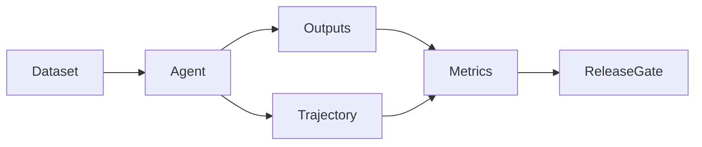

## 7. Security
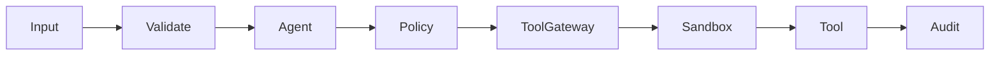

## 8. Production
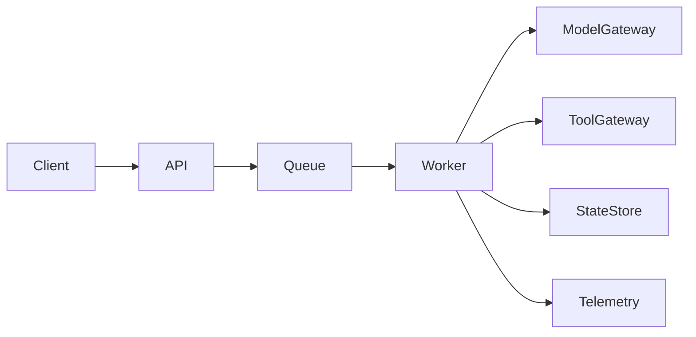

## 9. Observability
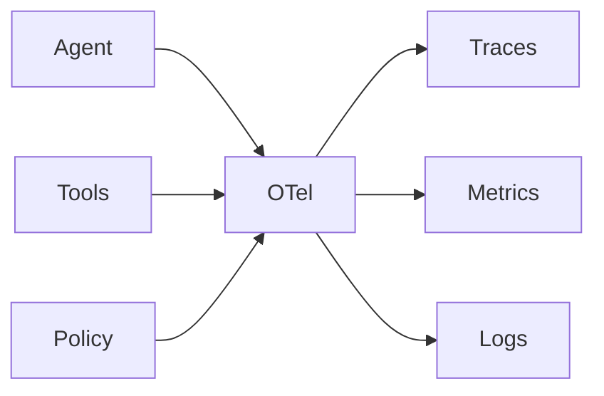

## 10. Enterprise
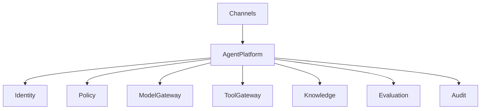

## 11. Capstone
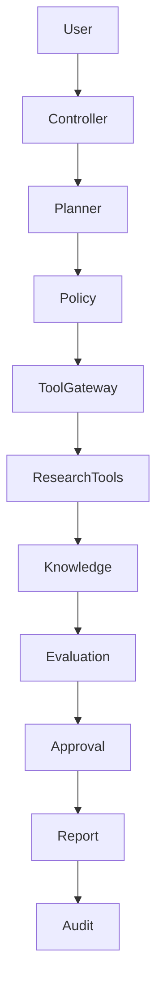

## 12. Learning pathway
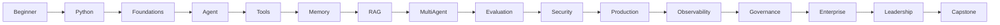
