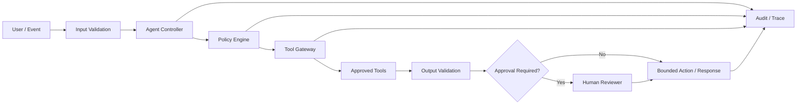

# Agent Security Reference Guide

Security is a throughline across Agentic AI Academy. This guide provides the canonical cross-module security model and complements [Module 09 — Security & Safety](../curriculum/09-agent-security/README.md) and the repository-level [SECURITY.md](../SECURITY.md).

## Security objective

An agent should receive only the capabilities required for the current task, for the minimum necessary duration, under explicit policy and observable controls. Model output is untrusted input until validated.

## Defense-in-depth control plane

## Core controls

| Control | Engineering requirement |
|---|---|
| Least privilege | Grant only explicitly required tools, data scopes and actions. |
| Explicit tool permissions | Default-deny unknown tools; separate read from write privileges. |
| Authentication | Verify the actor, service or workload identity before privileged access. |
| Authorization | Evaluate whether that identity may perform the specific action on the specific resource. |
| Input validation | Treat prompts, retrieved documents, web content and tool output as untrusted data. |
| Output validation | Validate structured outputs and action parameters before execution. |
| Policy enforcement | Put deterministic controls outside the model for high-impact decisions. |
| Human approval | Require approval for high-risk, irreversible, external or privileged actions. |
| Sandboxing | Run generated or untrusted code only in isolated, disposable environments. |
| Timeouts and action limits | Bound retries, steps, execution time and recursive behavior. |
| Token/cost budgets | Stop or degrade safely when consumption exceeds approved limits. |
| Secret management | Keep credentials outside prompts, source code and logs; use scoped secret stores. |
| Network restrictions | Limit outbound destinations and service access to approved endpoints. |
| Audit logging | Record policy decisions, tool calls, approvals, failures and outcomes. |
| Safe termination | Prefer fail-closed behavior when permissions, validation or policy state is uncertain. |

## Threats to design for

The Academy treats the following as first-class failure modes: direct and indirect prompt injection, malicious retrieved content, excessive agency, privilege escalation, confused-deputy behavior, data exfiltration, secret leakage, unsafe generated code, malicious tool output, unauthorized writes, uncontrolled retries, denial-of-wallet/cost escalation, and untraceable autonomous actions.

## Tool boundary pattern

Tools should expose narrow schemas rather than raw system access. A production tool wrapper should define:

- a stable name and purpose;
- typed, validated arguments;
- identity and authorization requirements;
- read/write classification;
- risk level;
- rate and resource limits;
- expected failure modes;
- approval requirements;
- auditable result metadata.

Never give an agent unrestricted shell, filesystem, database, browser, email, cloud or production-system access merely for convenience.

## Generated code

Generated code must **not** execute directly on the host machine. Use an isolated environment with explicit CPU, memory, time, filesystem and network limits. Capture stdout/stderr, evaluate the result, restrict retries, and destroy the environment after execution.

## Security gates before production

A production candidate should not pass deployment unless it has documented owners, a threat model, tool/data inventory, access-control rules, injection tests, safety regression tests, approval rules, secrets handling, logging, incident response, rollback behavior and evidence that high-impact actions fail safely.

See also:

- [Agent Risk Register](agent-risk-register.md)
- [Production Readiness Checklist](production-readiness-checklist.md)
- [Governance Checklist](agent-governance-checklist.md)
- [Deployment Playbook](deployment-playbook.md)
- [Enterprise Architecture](13-enterprise-architecture.md)

---

**Hendar Mawan, PhD**  
**Hendar Mawan : AI Engineering Leader**  
AI Engineering · AI Architecture · Agentic AI · Secure AI · Edge AI · AI Governance
