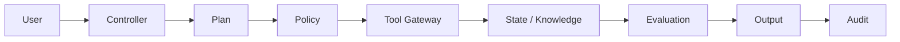

# Python Agent Tool Chest

## Learning objectives
- convert a business goal into explicit agent state and control flow
- define tool contracts and permissions
- add tests, evaluation criteria, failure handling and observability
- document security assumptions and extension points

## Architecture


## Requirements
Python 3.12+. Core exercises use the local framework-neutral package and deterministic tools. External model APIs are optional.

## Installation
```bash
pip install -e .[dev]
pytest
```

## Source code
Reuse and extend `src/agentic_ai/` plus the closest numbered example under `examples/`.

## Tests
Write a happy-path test, policy-denial test, malformed-input test, and recovery/timeout test where relevant.

## Expected output
A reproducible result with visible control decisions, bounded tool use, evaluation evidence and a trace.

## Failure modes
Wrong tool selection, unavailable tool, malformed arguments, stale retrieval, policy denial, timeout, partial execution, runaway retry, excessive cost and missing evidence.

## Security considerations
Keep credentials out of prompts/source control. Apply least privilege, validation, policy gates, approval for high-impact actions, budgets, network restrictions and audit logging. Generated code belongs in an isolated sandbox, not the host.

## Extension exercises
1. Add a strict-schema tool.
2. Create a ten-case golden dataset.
3. Add latency/cost accounting.
4. Add one approval gate.
5. Write a production-readiness review.
