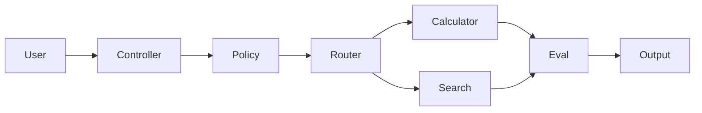

# Calculator + Search Agent

## Learning objectives
Build a deterministic two-tool agent, select tools from task intent, validate tool arguments, enforce allowlists, capture a trace, and evaluate tool accuracy.

## Architecture

## Requirements and installation
Python 3.12+. Run `pip install -e .[dev]` and `pytest`.

## Source code
Start from `examples/03_function_calling.py` and `examples/04_tool_agent.py`.

## Tests
Cover correct routing, malformed input, disallowed tool, timeout and deterministic output.

## Expected output
A result plus trace showing the chosen tool and policy decision.

## Failure modes
Ambiguous intent, wrong routing, invalid parameters, missing tool, timeout and unauthorized capability.

## Security considerations
Tools are allowlisted and validated; no credentials are required for the reference implementation.

## Extension exercises
Add a third read-only tool, confidence-based abstention and a tool-accuracy evaluation set.
