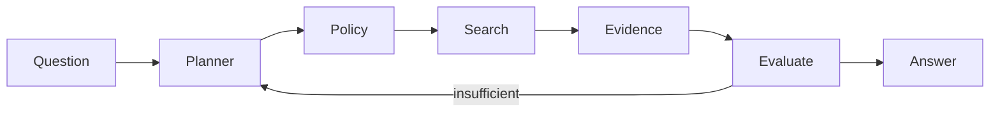

# Smart Research Sidekick

## Learning objectives
Implement a bounded research loop with planning, evidence retrieval, state, stopping, evaluation and traceability.

## Architecture

## Requirements and installation
Python 3.12+. Core version is deterministic and API-key free.

## Source code
Extend `examples/02_agent_loop.py`, `examples/06_rag_agent.py` and `src/agentic_ai/`.

## Tests
Cover evidence found, insufficient evidence/abstention, step-budget exhaustion and tool denial.

## Expected output
A cited answer or explicit abstention with a run trace.

## Failure modes
Weak evidence, looping, stale sources, unsupported claims and overbroad retrieval.

## Security considerations
Read-only tools first; source allowlists and retrieval authorization belong outside model instructions.

## Extension exercises
Add reranking, source quality scoring, a cost budget and a human review path.
