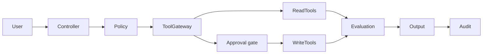

# Tool-Using Enterprise Agent

## Learning objectives
Design a policy-gated enterprise agent with multiple tools, explicit permissions, typed contracts, audit evidence and human approval for high-impact operations.

## Architecture

## Requirements and installation
Python 3.12+. Run `pip install -e .[dev]` and `pytest`.

## Source code
Extend the framework-neutral tool registry and policy engine.

## Tests
Cover allow, deny and approval decisions; malformed tool arguments; timeout; and audit events.

## Expected output
A final answer/action proposal accompanied by policy decisions, tool evidence and a trace.

## Failure modes
Over-permission, wrong tool, unavailable dependency, ambiguous approval state and missing audit evidence.

## Security considerations
Scope identities and credentials per tool. Default deny. Do not let the model bypass policy or authorization.

## Extension exercises
Add a real read-only API adapter, then define what evidence would be required before adding one state-changing API.
