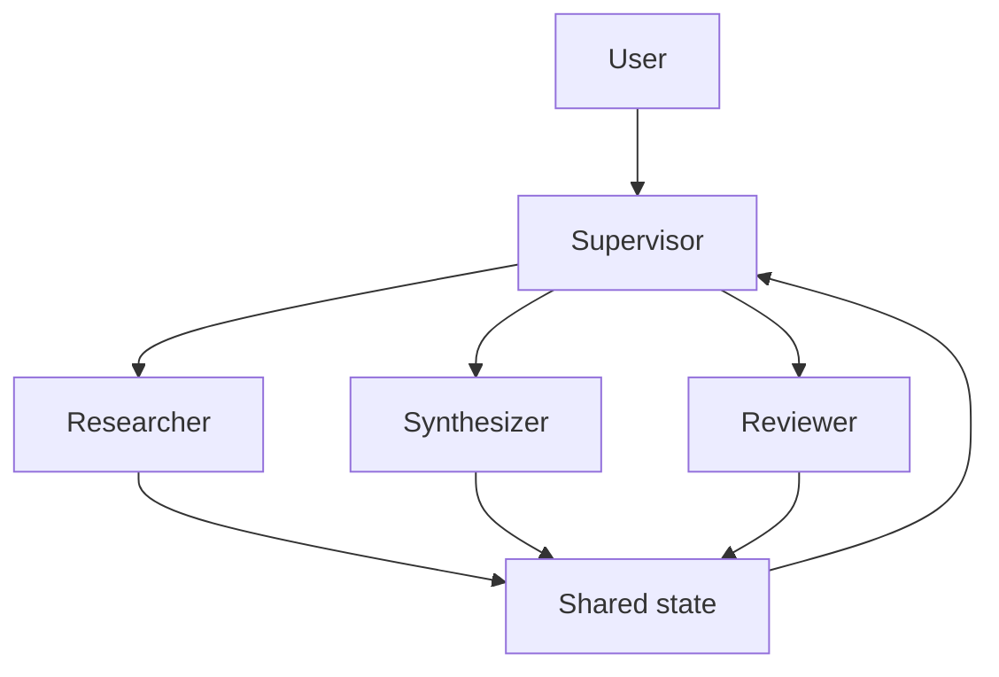

# Multi-Agent Research Team

## Learning objectives
Use a supervisor with specialized researcher, synthesizer and reviewer roles only where specialization provides measurable value.

## Architecture

## Requirements
Python 3.12+. Begin with deterministic role functions before adding a framework.

## Installation
`pip install -e .[dev]` then `pytest`.

## Tests
Verify routing, shared-state integrity, reviewer rejection and termination limits.

## Expected output
A synthesis with independent review evidence and an inspectable coordination trace.

## Failure modes
Role duplication, circular delegation, conflicting state, correlated errors and cost amplification.

## Security considerations
Roles do not implicitly inherit each other's permissions. Tool access remains explicit per role.

## Extension exercises
Map the same architecture to LangGraph, CrewAI or a Microsoft agent framework and compare complexity, observability and failure behavior.
