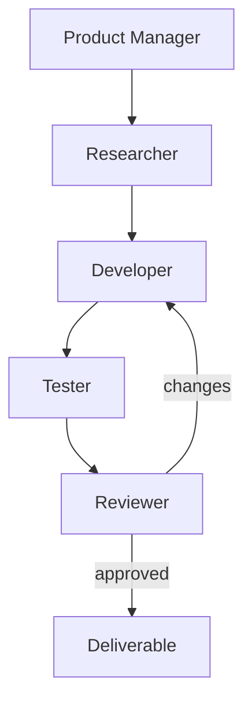

# AI Software Engineering Team

## Learning objectives
Coordinate Product Manager, Researcher, Developer, Tester and Reviewer roles around explicit acceptance criteria, bounded tools and independent verification.

## Architecture

## Requirements
Python 3.12+. Use synthetic/local tasks and no privileged repository access in the starter.

## Installation
`pip install -e .[dev]` and `pytest`.

## Tests
Validate role handoffs, acceptance criteria, failed tests, reviewer rejection and stop limits.

## Expected output
A tested artifact plus trace of requirements, implementation, verification and review.

## Failure modes
Specification drift, self-review bias, fabricated test results, uncontrolled code execution and endless repair loops.

## Security considerations
Code proposals are data until checked and executed in an isolated environment. Keep production credentials and repositories outside the learning sandbox.

## Extension exercises
Add issue decomposition, test evidence, change summaries and a human merge gate.
