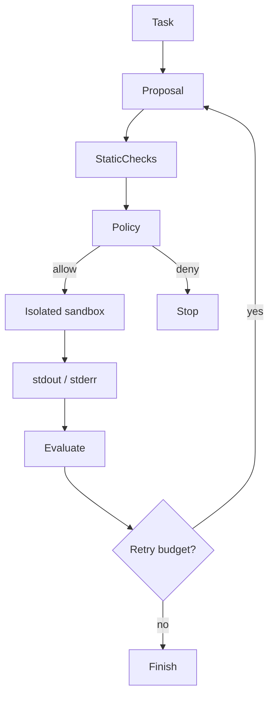

# Secure Code Agent

## Learning objectives
Design the control plane for receiving a task, proposing code, checking it, executing only inside an isolated environment, capturing stdout/stderr, evaluating the result, retrying within limits and terminating safely.

## Architecture

## Requirements
The repository starter validates code strings and emits a sandbox plan; it intentionally does **not** execute generated code on the host.

## Installation
`pip install -e .[dev]` and `pytest`.

## Tests
Cover safe snippets, blocked patterns, retry limits and sandbox configuration expectations.

## Expected output
A policy decision and execution plan suitable for a separate hardened container/microVM service.

## Failure modes
Host execution, unrestricted network/filesystem access, resource exhaustion, secret leakage and retry loops.

## Security considerations
Use ephemeral isolation, no ambient credentials, restricted network/filesystem/syscalls, CPU/memory/time limits, non-root users and auditable input/output.

## Extension exercises
Integrate a dedicated sandbox service and prove isolation with tests rather than relaxing host safeguards.
