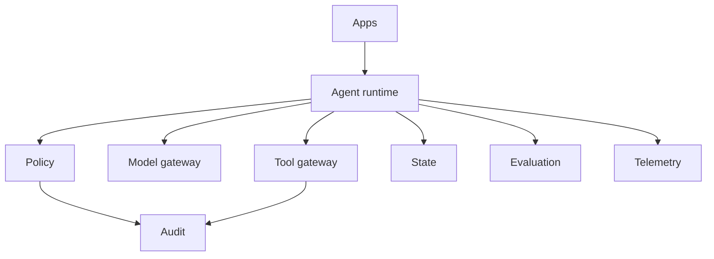

# Production Agent Platform

## Learning objectives
Assemble reusable agent runtime, policy, tool gateway, model gateway, state, evaluation, telemetry and deployment controls.

## Architecture

## Requirements
Python 3.12+, container runtime for deployment exercises, CI and explicit configuration.

## Installation
`pip install -e .[dev]`; run `pytest` and the example validator.

## Tests
Unit, integration, regression, safety and configuration tests plus failure injection for key dependencies.

## Expected output
A production-oriented reference platform with health checks, budgets, tracing, tests and operational documentation.

## Failure modes
Shared over-privilege, retry storms, hidden state, provider outage, queue backlog, evaluation drift and configuration divergence.

## Security considerations
Separate identities and credentials, isolate tool access, externalize secrets, log policy decisions and support rapid capability revocation.

## Extension exercises
Add a queue/state backend, OpenTelemetry exporter, model router and staged deployment workflow.
