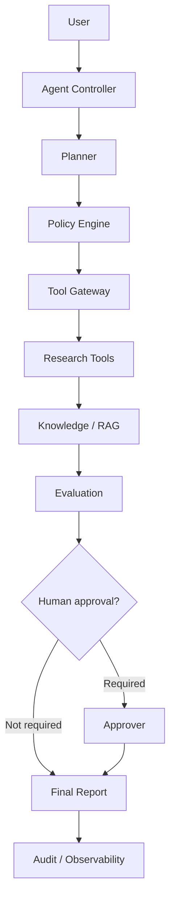

# Responsible Enterprise Research Agent

## Learning objectives
- convert a business goal into explicit agent state and control flow
- define tool contracts and permissions
- add tests, evaluation criteria, failure handling and observability
- document security assumptions and extension points

## Architecture


## Requirements
Python 3.12+. Integrate tool use, RAG, memory, structured outputs, evaluation, security, observability, human-in-the-loop controls, cost limits, failure recovery and audit evidence.

## Installation
```bash
pip install -e .[dev]
pytest
```

## Source code
Reuse and extend `src/agentic_ai/`, the numbered examples and evaluation harness. Keep model integration behind a narrow adapter so policy/control logic remains testable without a network call.

## Tests
Include happy path, policy denial, approval-required, malformed input, retrieval failure, timeout, budget exhaustion, regression and safety tests.

## Expected output
A cited research report or safe abstention, accompanied by trace, evaluation metrics, cost/resource accounting, policy decisions and audit evidence.

## Failure modes
Wrong tool selection, unavailable dependency, stale retrieval, policy denial, timeout, partial execution, excessive retry/cost, unsupported claims and missing evidence.

## Security considerations
Least privilege, input/output validation, policy gates, human approval for high-impact actions, explicit budgets, secret isolation, network restrictions, and audit logging are mandatory. Generated code must run only inside a properly isolated sandbox; the reference package does not execute generated code on the host.

## Extension exercises
1. Add authorization-aware enterprise retrieval.
2. Build a 50+ case golden evaluation dataset.
3. Add latency/token/cost dashboards.
4. Add approval and rollback workflows.
5. Produce a production-readiness and governance review.
